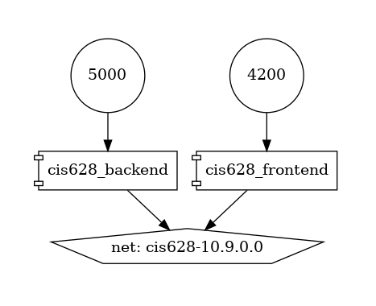
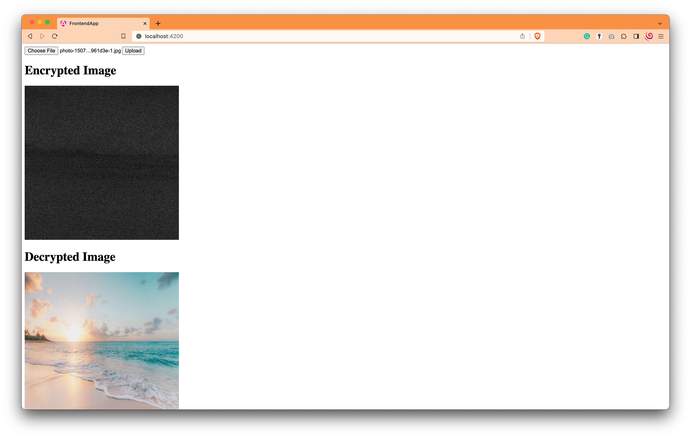

# CIS628
## Project Title
Image Encryption using Elliptic Curve Cryptography

## Project Members
- Aman Velani
- Ayush Saxena
- Jineet Maharajwala
- Saurabh Borsiwala

## Project Description
The project aims to encrypt an image using Elliptic Curve Cryptography. The image is first converted into a matrix of pixels. The matrix is then converted into a vector and then the vector is encrypted using ECC. The encrypted vector is then converted back to a matrix and then to an image.

## How to run the project with Docker
- Clone the repository : https://github.com/amanvelani/CIS628
- Run the following command to  build the docker container
    ```
    sudo docker-compose build --no-cache
    ```
- Run the following command to start the docker container
    ```
    sudo docker-compose up
    ```
- Open the browser and go to http://localhost:4200
- Upload an image and click on upload button
- The browser will display the encrypted image and the decrypted image

## Docker Network
- The docker-compose.yml file contains the network configuration for the docker containers.
- Below is the image of the network configuration


## Demo Steps
1. Open the browser and go to http://localhost:4200

2. Upload an image and click on upload button

3. The browser will display the encrypted image and the decrypted image(p.s. it will take some time for the process to complete based on image size)
